# PORTSWIGGER WEB SECURITY ACADEMY
# Access Control Vulnerabilities and Privilege Escalation

## Concept (LAB 1 - 4)
- The first four labs regarding access control vulnerabilites are based on **Vertical Privilege Escalation**.
- Access control is defined as restrictions on who or what is allowed to access resources or functionality on a site. **Vertical Privilege Escalation** is a type of an access control vulnerability.
- In this vulnerability, a user can access functionality on a web application for which they are not granted access to by the admin.
  
### LAB 1: Unprotected Admin Functionality
### Solution:
- A link to a shopping website is provided. The goal is to access the user list through the unprotected admin panel and delete the user ```carlos```.
- To solve this lab, modify the site URL by adding ```/robots.txt```. Unprotected websites usually keep sensitive data within their servers in files named as such.

  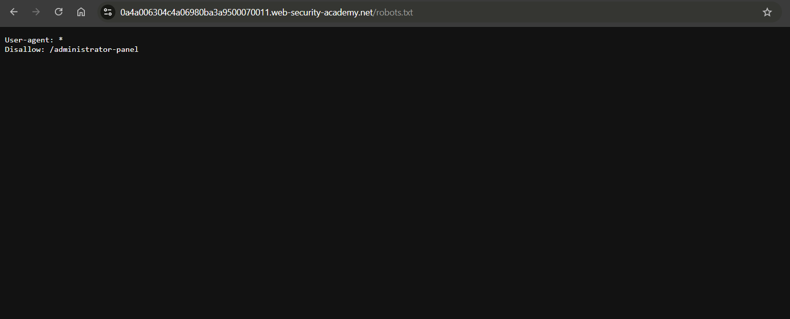

- Within this file, we find the URL to the administrative interface ```/administrator-panel```.
- Modify the URL once again by adding the newly found URL and the administrator interface can be accessed. The user ```carlos``` can now be deleted easily.

  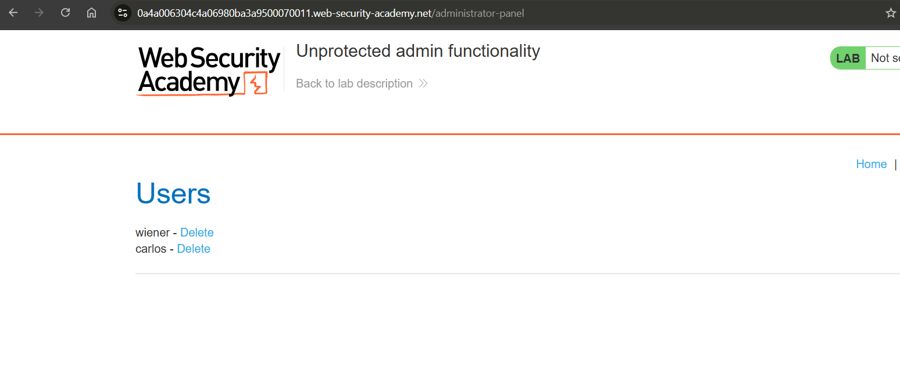

- The solution of this lab was based on unhindered access to both the files in the server and to the administration interface.

### LAB 2: Unprotected Admin Functionality With Unpredictable URL
### Solution:
- To solve this lab, inspect the elements on this website to find the JavaScript snippet that acts as the authenticator for the administration interface.
- Within the 'Elements' tab in 'Developer Tools' follow the following pattern when checking different elements:


  1. ```<div theme> ... </div>```
  2. ```<section class = "maincontainer"> ... </section>```
  3.  ```<div class="container is-page> ... </div>```
  4. ```<header class="navigation-header> ... </header>```
  5. ```<section class = "top-links"> ... </section>```
  6. ```<script> ... </script>```
   

  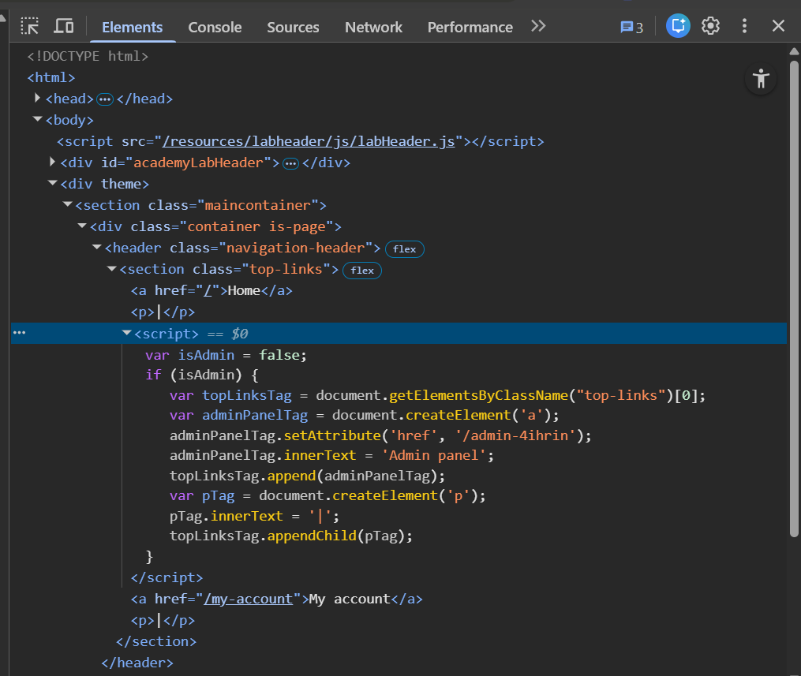


- Within the Javascript snippet, search for the attribute to be added to the URL in case of an admin signing in to their account.
  ```js 
  adminPanelTag.setAttribute('href', '/admin-4ihrin');
  ```
- Copy the attribute and add to the URL which will grant access to the administration interface.

  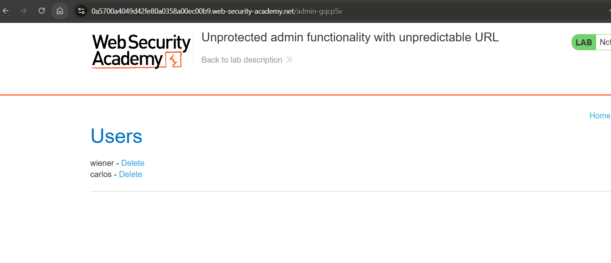

### LAB 3: User Role Controlled by Request Parameter
### Solution:
- Similar to the previous two labs, we have to access the admin panel in order to delete the user ```carlos```. The difference here is that this web application identifies whether or not the user is an admin via an 'Authentication Cookie' (a block of data generated by the web server that stores a user's login data while the user is browsing that particular website).
- This cookie provides access to the admin interface if the data provided in the login field is correct. After the user signs in to their account on the shopping website,

  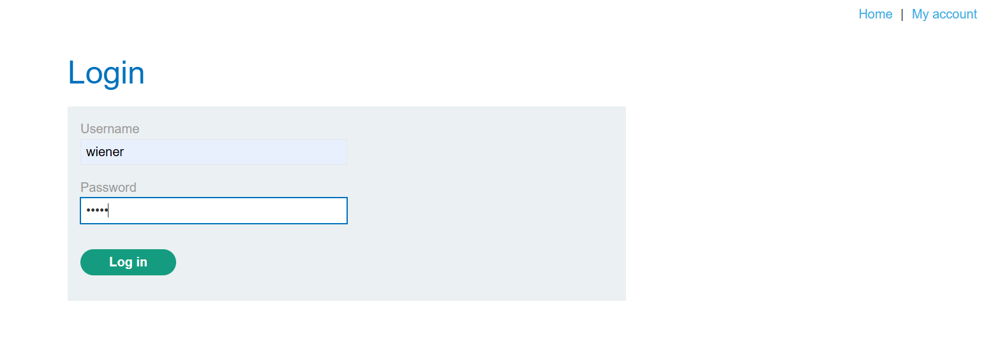

  

  a cookie by the name of 'Admin' is set to the value "false" if the user is not an admin.

  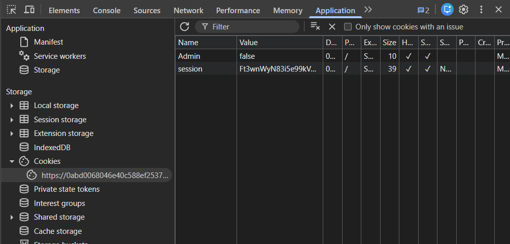


- Change the value of the 'Admin' cookie to 'true'. 

  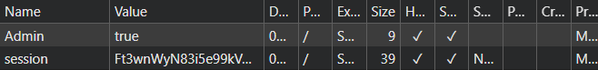
  
  Refresh the website and an option for the 'Admin panel' will appear.

  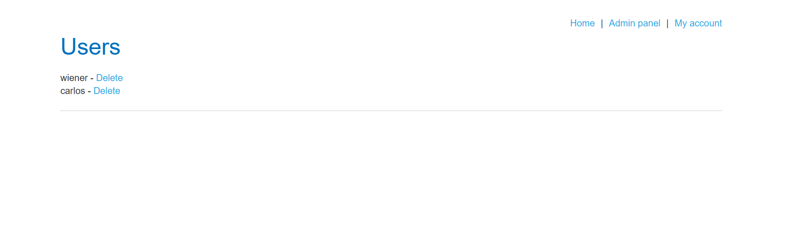


### LAB 4: User Role can be Modified in User Profile
### Solution:
- In this lab, we have an admin panel at ```/admin``` which is only accessible for users with a ```roleid=2```. We have to access the admin panel in order to delete the user ```carlos```.
  
  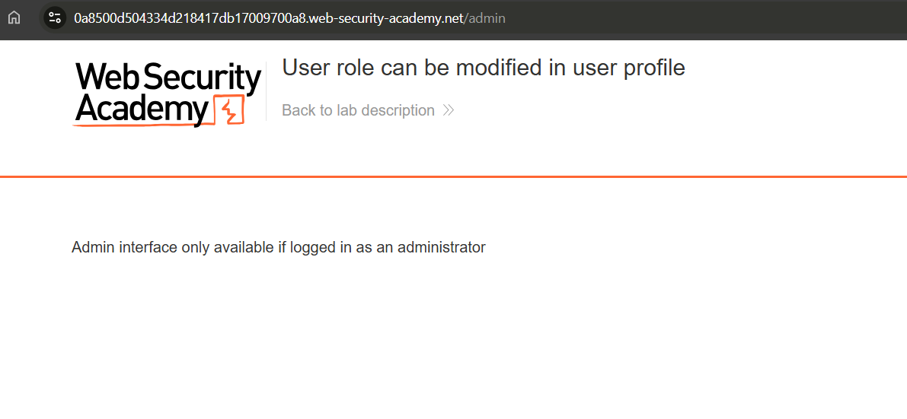

- To solve this lab, we are going to need Burp Suite. Start BurpSuite and within the 'Proxy' tab in Burp, select the 'Intercept' tab and open this lab in the BurpSuite associated Chromium browser.

  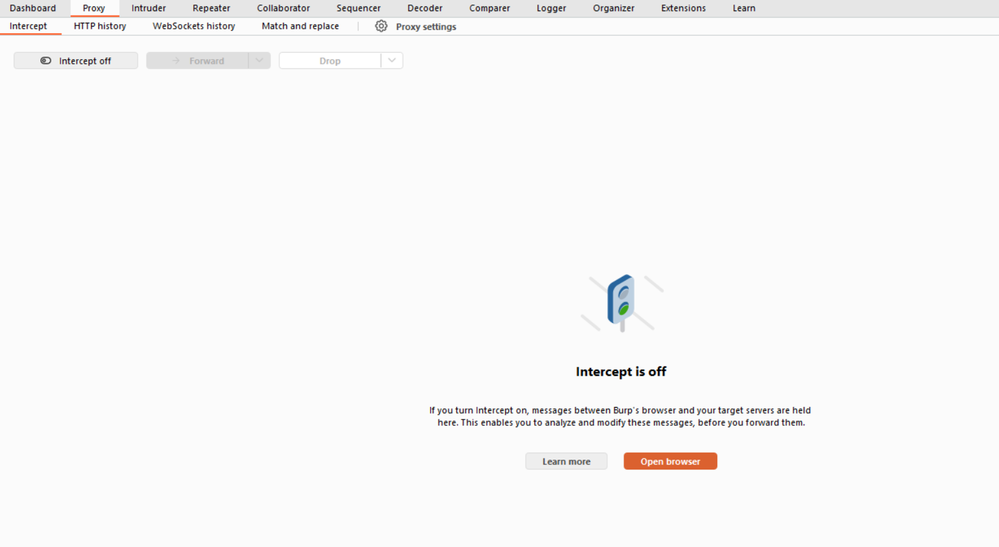

- Do not start intercepting the HTTP requests and responses until the account is logged into as intercepting and forwarding these messages will be a wastage of time.
- After logging into the account using the provided credentials through the 'My Account' tab, the user's panel will be visible.
  
    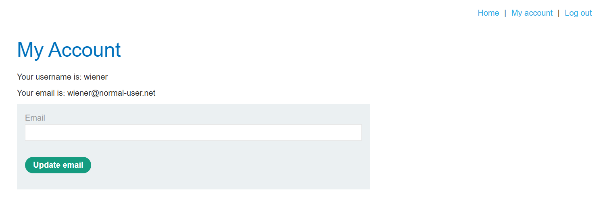
  
- Before this step, start intercepting requests in Burp by turning on 'Intercept' in Burp. Now, update your email by entering any text of this format 'text@text'.
- Burp will immediately intercept this POST request. Select this request and edit it so that it not only changes the email parameter for this user but also the 'roleid' parameter.

  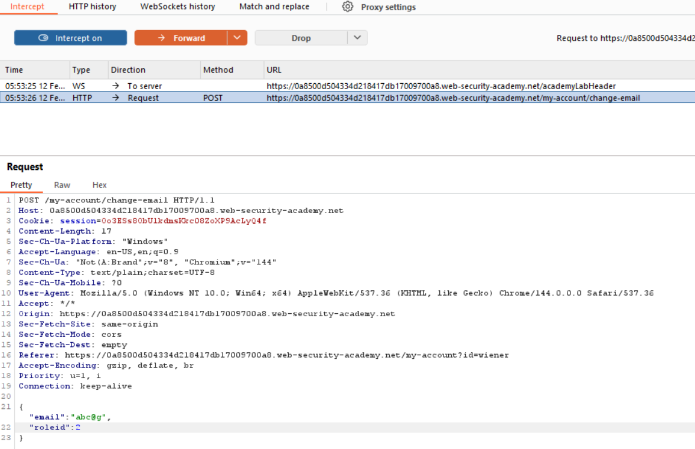


- Forward this request along with any other request that pops up afterwards until you see this change on the website:
  
  

- Select the 'Admin Panel' and remove the user ```carlos```.
  
  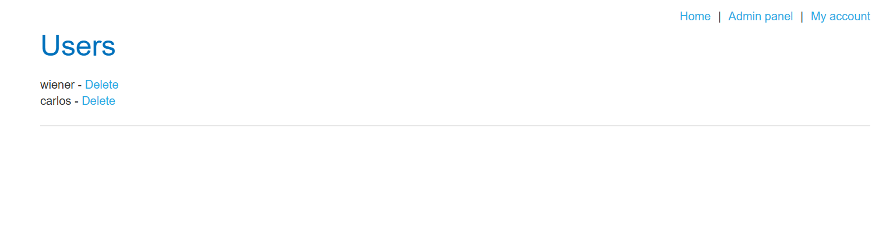


> NOTE: In order to see all the parameters available for a user alongwith 'email' and 'roleid', go to the 'HTTP History' tab within the 'Proxy' tab on Burp. Select the POST request ```/my-account/change-email``` and go through the response (which is a JSON file) for this request to see all the parameters within. 

  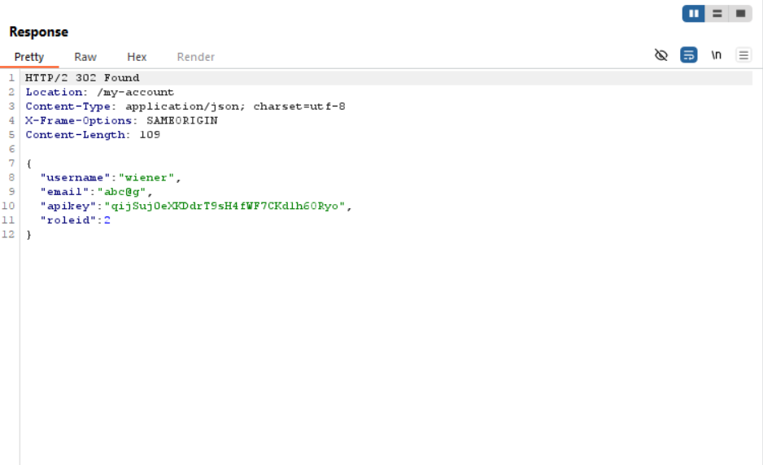
   
## Concept (LAB 5 - 8)
- The next labs regarding access control vulnerabilites are based on **Horizontal Privilege Escalation**.
- Access control is defined as restrictions on who or what is allowed to access resources or functionality on a site. **Horizontal Privilege Escalation** is a type of an access control vulnerability.
- In this vulnerability, a user can access resources of other users on a web application aside from the same resources provided to them by the web application.

### LAB 5: User Role Controlled by Request Parameter
### Solution:
- In this lab, we are given a shopping website and we have to submit the API key for user ```carlos``` which will be available if we login to his account.
- This lab can be solved on the basis of ```Insecure Direct Object Reference (IDOR)``` vulnerabilities.
  
  > IDOR vulnerabilities are when URL parameter values, which users can control, are used to access resources.

- To solve this lab, login to your account by using the provided credentials through the 'My Account' panel.

  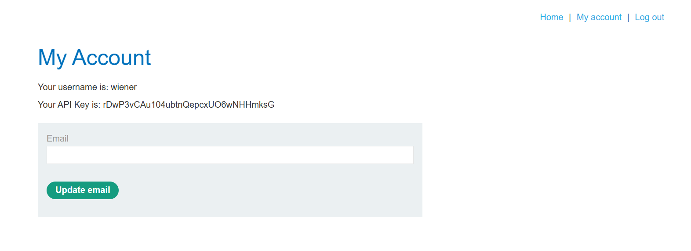

- After logging in, replace your ID in the URL parameter with 
```carlos```:
  
  From
  ```
  web-security-academy.net/my-account?id=wiener
  ```
  to
  ```
  web-security-academy.net/my-account?id=carlos
  ```
- You will now gain access to the required account and the API key.
  
    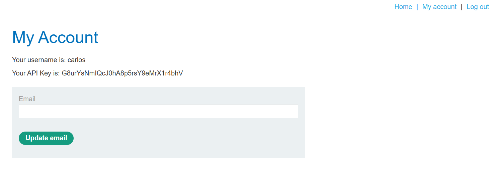


### LAB 6: User Role Controlled by Request Parameter, with Unpredictable User IDs
### Solution:
- In this lab, we are given a blogging website and we have to submit the API key for user ```carlos``` which will be available if we login to his account. The accounts on this website have a 'Globally Unique Identifier' (GUID) which is used to identify users and prevent ```Insecure Direct Object Reference (IDOR)``` vulnerabilities.

- To solve this lab, find the post(s) made by the user ```carlos``` and click on his profile name.
  
  *NOTE: The posts and GUID will be different for each lab attempt.*

    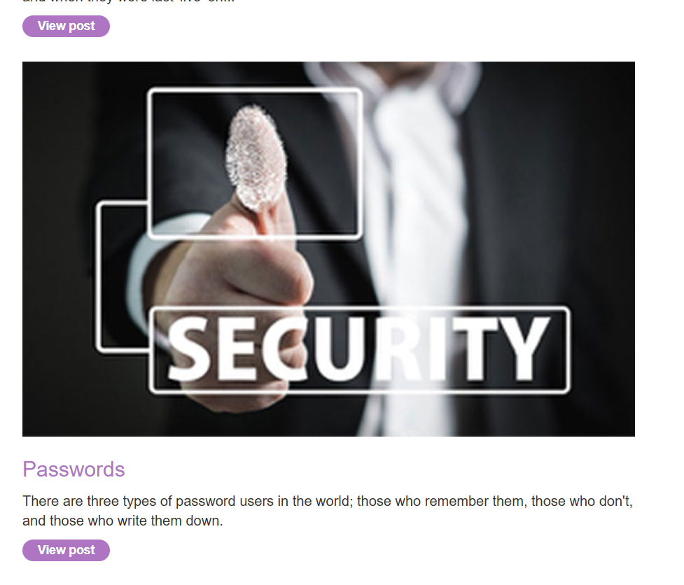

    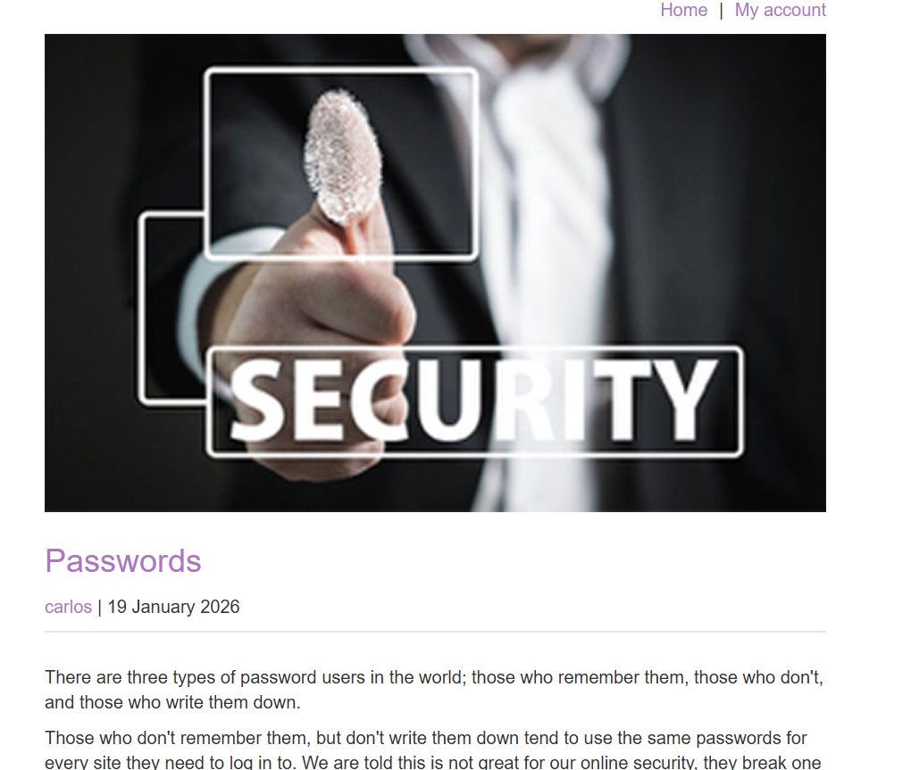

- The profile will show the posts made by the user and in the URL, the GUID for the user will be visible.

  ```web-security-academy.net/blogs?userId=6cb87e0a-bb24-4459-9437-ab8ed20f434b```

  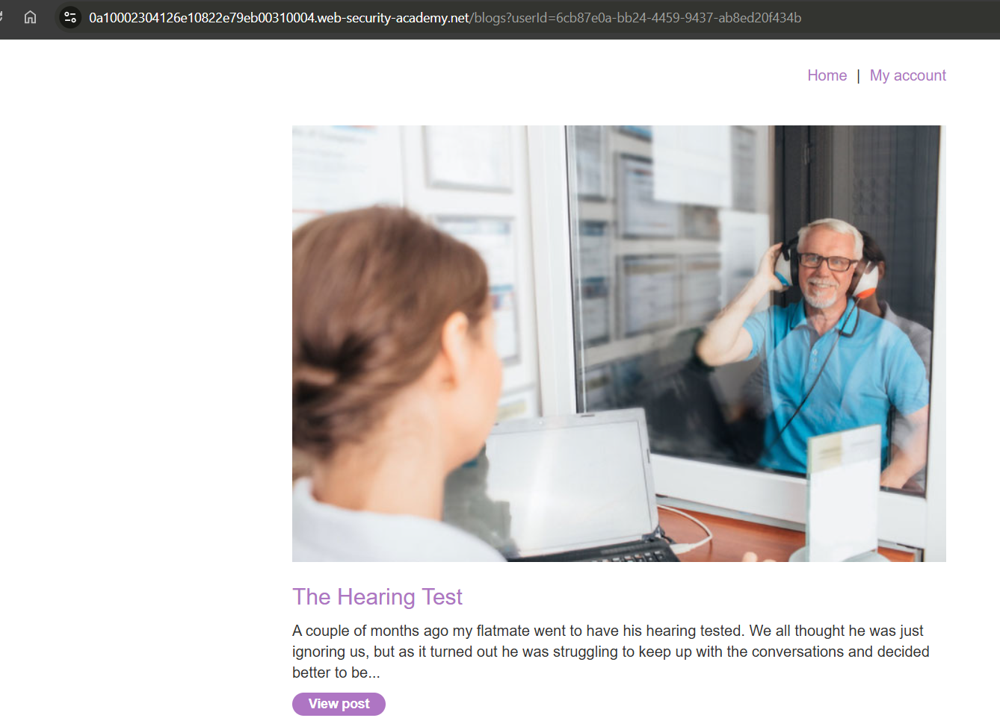

- Copy this GUID and sign in to this user's account.
  
  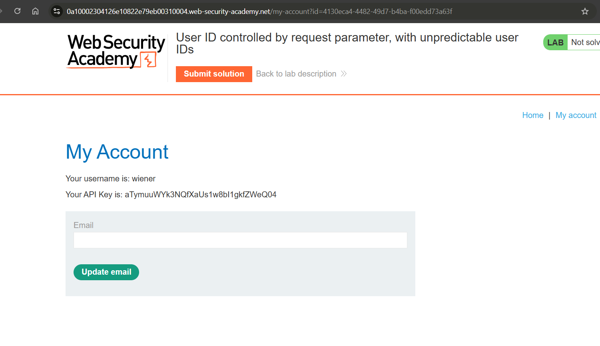

- Replace the provided GUID in the URL with the copied GUID.
- 
  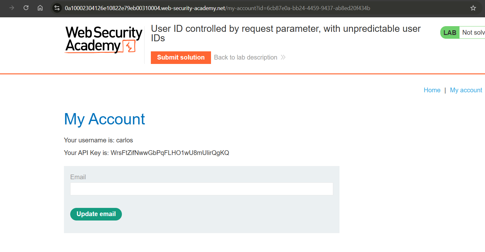

- The required account and the API key will now be visible.

### LAB 7: User ID Controlled by Request Parameter with Password Disclosure
### Solution:

*NOTE: This lab will deal with both horizontal and vertical escalation.*

- In this lab we are given a shopping website and are tasked with finding the username and password of the web application admin in order to remove the user ```carlos```.
- To solve this lab, start by going logging in to the account by going to the 'My Account' tab and using the username and password provided in the lab introduction.
- After signing in, the 'My Account' tab will will be changed within the website. This tab will now provide the function of updating the email or changing the password. It prefills the password space with a masked input of the current password.

  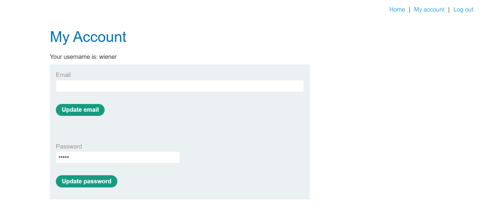

- Replace the URL of the 'My Account' tab from
  
  ```js
  web-security-academy.net/my-account?id=wiener
  ```

  to

  ```js
  web-security-academy.net/my-account?id=administrator
  ```

  We will now be able to see the 'My Account' tab for the admin.

  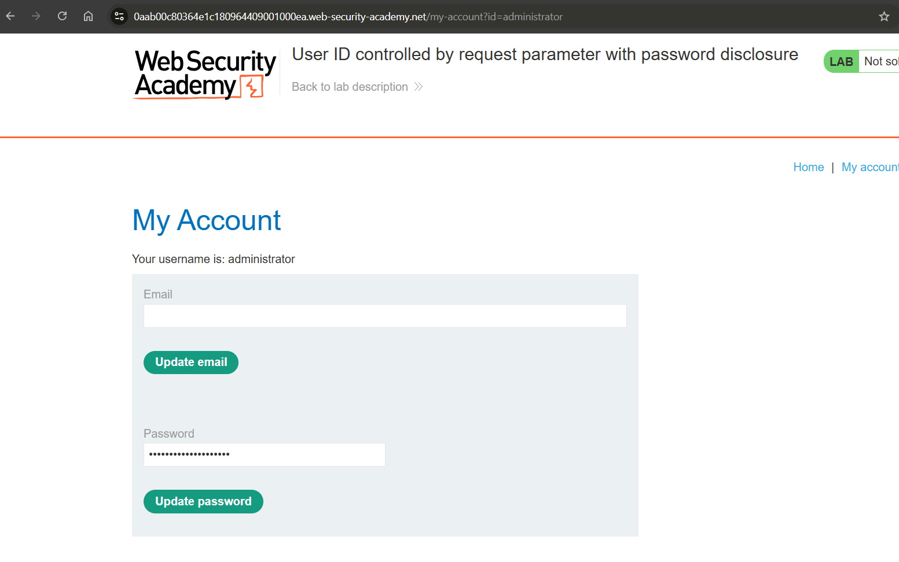

- To find the password for the admin account from the masked input, inspect the web elements in this pattern:


  1. ```<div theme> ... </div>```
  2. ```<section class = "maincontainer"> ... </section>```
  3. ```<div class="container is-page> ... </div>```
  4. ```<div id="account-content"> ... </div>```
  5. ```<form class="login-form" action="/my-account/change-password" method="POST"> ... </form>```
  6. ```<input required="" type="password" name="password" value="sn9dwouuhjj97ihqqw36">```


  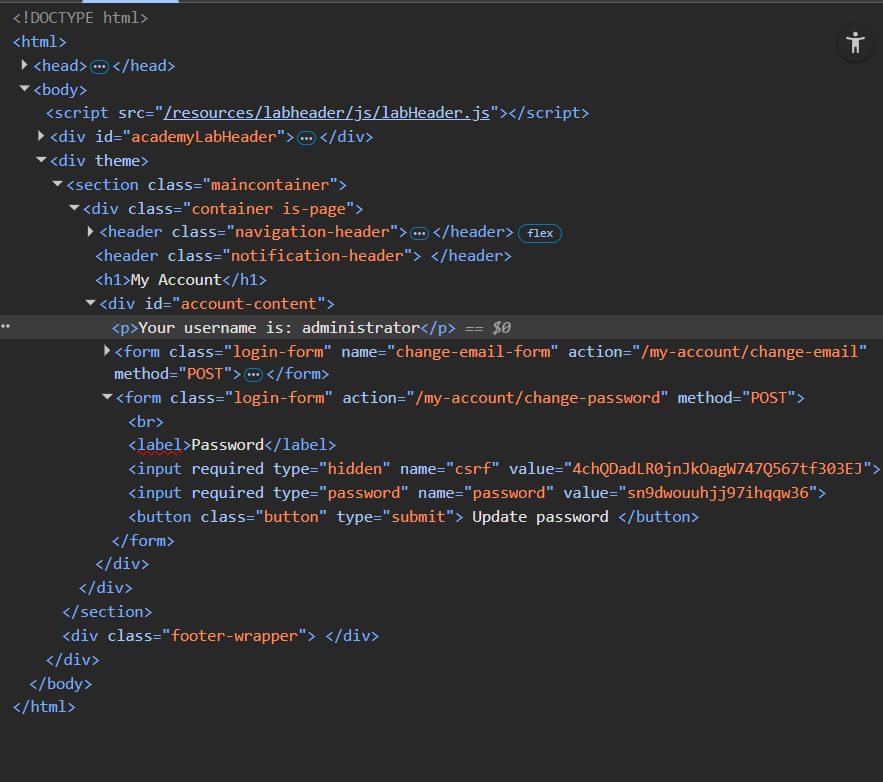

  The 'value' in the 'input' element named 'password' is the admin account password. Copy this value.
- Log out as user and login back again using the username 'administrator' and use the copied password.
- As the admin, a new tab will be present on the website named 'Admin Panel'.

  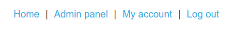

  The user ```carlos``` can be deleted in this panel.

  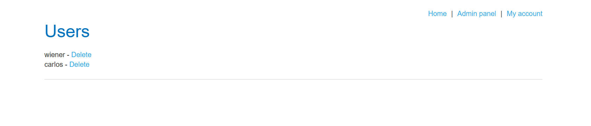

### LAB 8: User Role Controlled by Request Parameter, with Data Leakage in Redirect
### Solution:
- In this lab we are provided a shopping website and are tasked with finding the the API key for user ```carlos```.
- This lab is an advanced version of Lab 4 and requires the usage of BurpSuite.
- The concept is similar to Lab 4  except that directly trying to change the ID within the URL from the user of the provided credentials to the targeted user is not possible.  This is because the web applications now detects unauthorized attempts and redirects back to the login page.
- To solve this lab, start BurpSuite. Within the 'Proxy' tab in Burp, select the 'Intercept' tab and open this lab in the BurpSuite associated Chromium browser.

  

- Do not start intercepting the HTTP requests and responses until you are logged into your account as intercepting and forwarding these messages will be a wastage of time.
- After you are logged in using the provided credentials, similar to Lab 4, change the URL parameter i.e

  from
  ```
  web-security-academy.net/my-account?id=wiener
  ```
  to
  ```
  web-security-academy.net/my-account?id=carlos
  ```
  Make sure to turn intercept on before this step. Enter the modified URL.
- The 'GET' request to the server for the account of ```?id=carlos``` will be visible in the list of intercepted requests.

  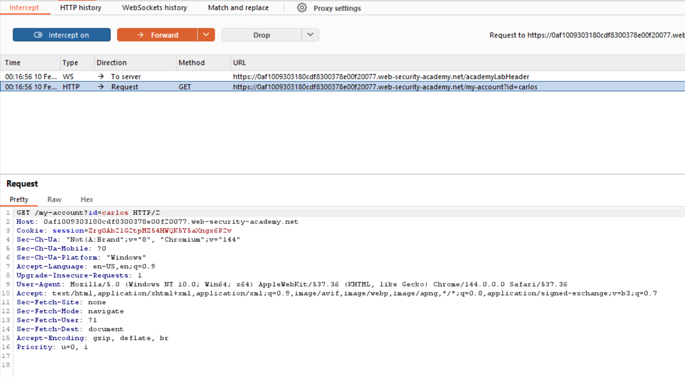

  Forward this request.

- Switch tabs from 'Intercept' to 'HTTP history'. On top or near the top of the list, select the intercepted 'GET' request (for ```carlos```) that we just forwarded. The request and response from the server will be visible.

  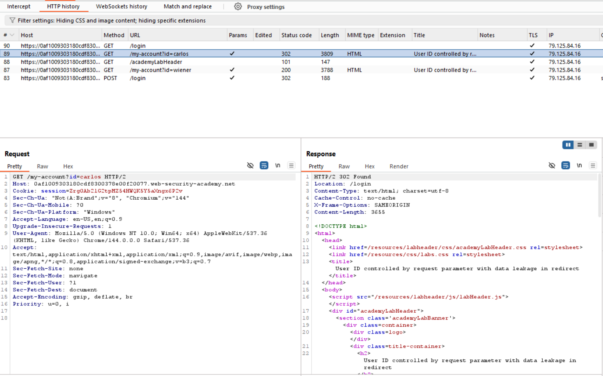

- While on the browser, we are redirected back to the login page, we learn through Burp that our request is not ignored. Inside the response, we find that the server has fullfilled our 'GET' request. The response contains the target account and all the data on it.

  

- Find the API key from within the website elements.
